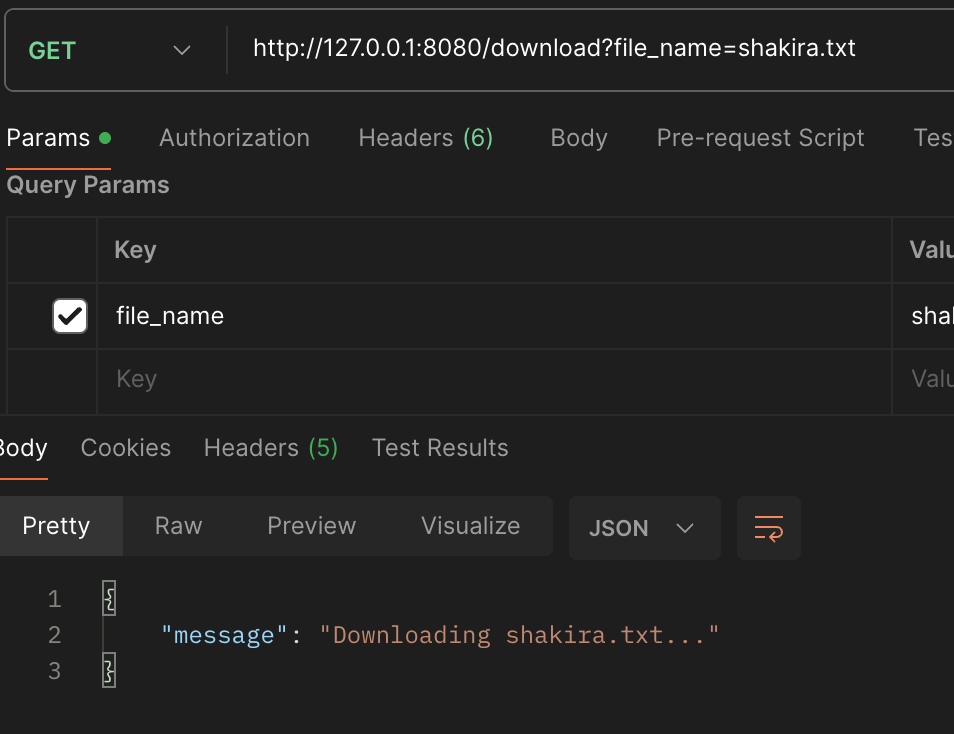
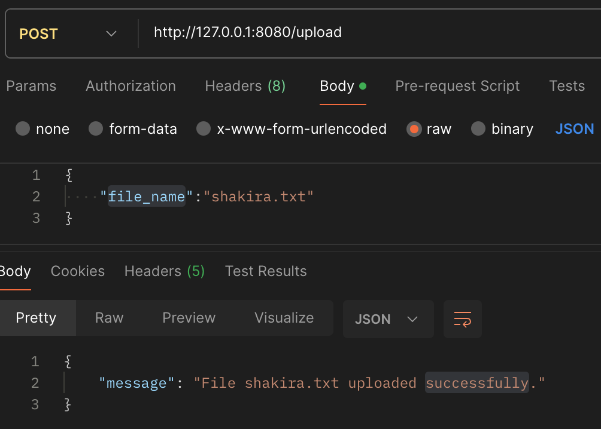
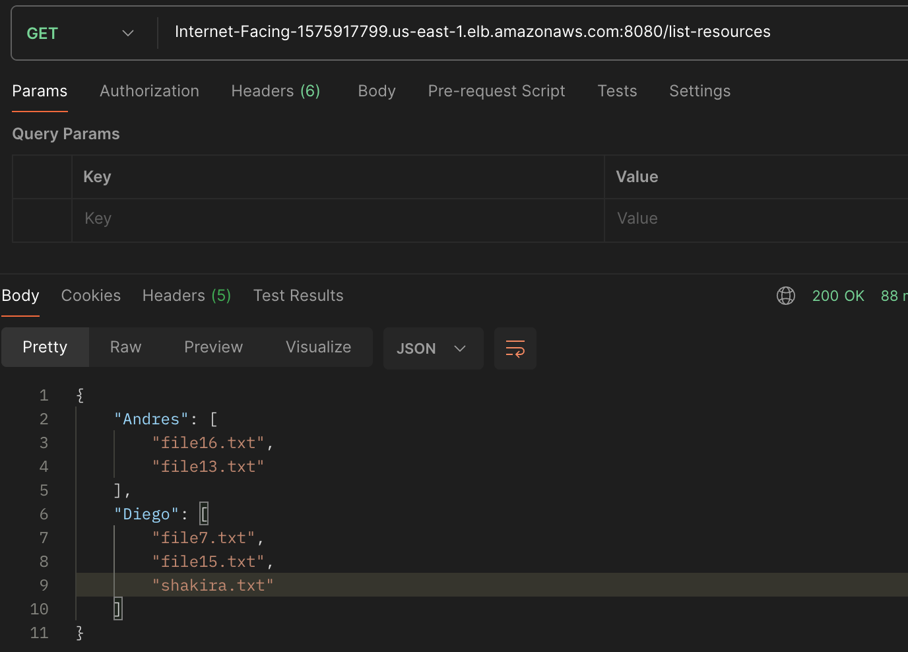
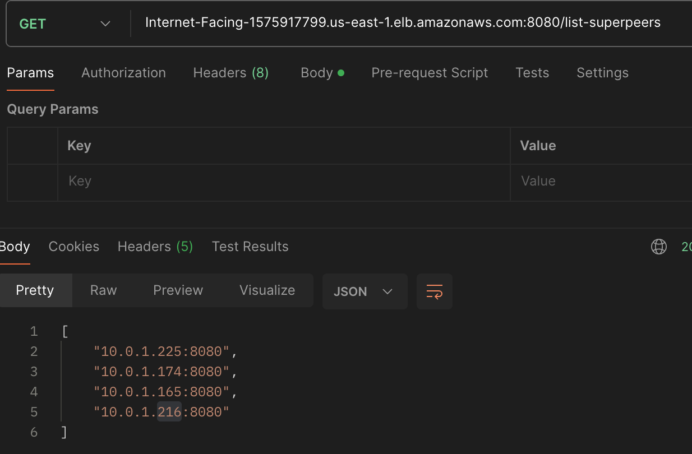
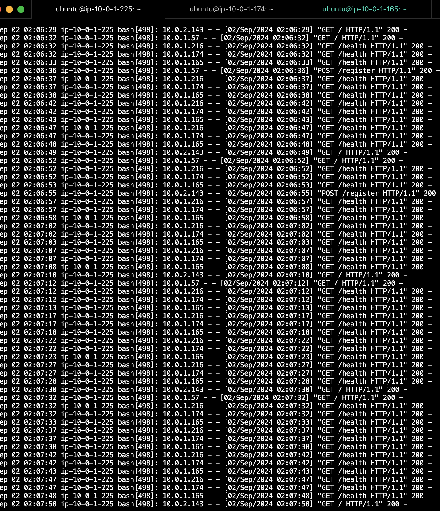
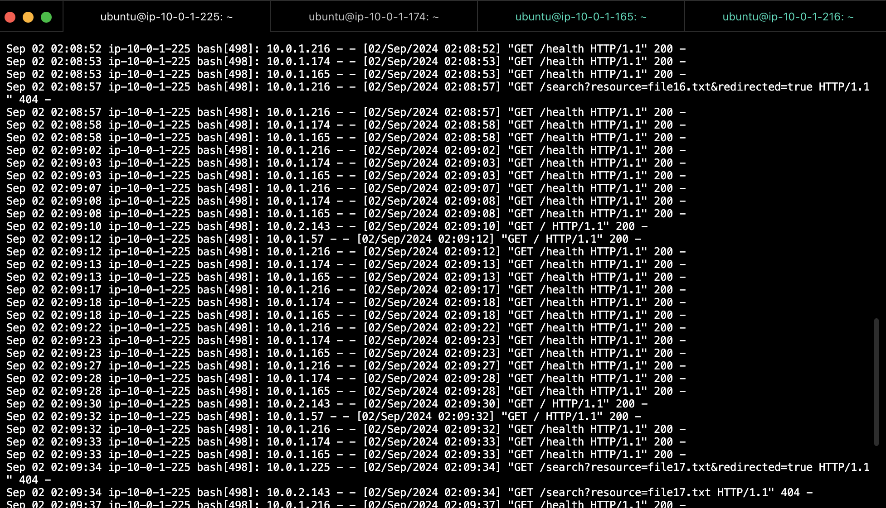

# info de la materia: ST0263 <Topicos de Telematica>
#
# Estudiantes: Brayan Daniel Cano Pérez, bdcanop@eafit.edu.co, Diego Alexander Munera Tobon, damunerat@eafit.edu.co
#
# Profesor: Edwin Nelson Montoya Munera, emontoya@eafit.edu.co

# Reto 1
#
# 1. breve descripción de la actividad
 Este proyecto consiste en la implementación de una red P2P descentralizada, donde cada nodo (peer) se conecta a un superpeer. El superpeer se encarga de gestionar la búsqueda de recursos entre los peers que tiene conectados. Si un superpeer no encuentra un recurso solicitado, reenvía la petición a otros superpeers en la red, logrando así una búsqueda distribuida y eficiente a través de toda la red P2P.

## 1.1. Que aspectos cumplió o desarrolló de la actividad propuesta por el profesor (requerimientos funcionales y no funcionales)
* Implementación de una arquitectura P2P con superpeers, donde cada superpeer puede reenviar peticiones de búsqueda de recursos a otros superpeers si no encuentra los recursos en sus propios peers.
* Gestión dinámica de los recursos de los peers, donde los superpeers actualizan su lista de recursos disponibles cada vez que un peer se conecta, desconecta, o modifica sus recursos.
* Implementación de mecanismos de ping entre superpeers para mantener un listado actualizado de superpeers activos en la red.

### Método Download

### Método Upload

### Método List-Resources

### Método List-Superpeers

### Superpeer logs con registro

### Superpeer con busqueda

## 1.2. Que aspectos NO cumplió o desarrolló de la actividad propuesta por el profesor (requerimientos funcionales y no funcionales)
* Todos los aspectos funcionales y no funcionales solicitados por el profesor fueron implementados.

# 2. información general de diseño de alto nivel, arquitectura, patrones, mejores prácticas utilizadas.
La arquitectura de este proyecto sigue un modelo P2P con superpeers que actúan como coordinadores. Los superpeers no sólo gestionan las peticiones de los peers conectados, sino que también interactúan entre sí para garantizar la disponibilidad de recursos en toda la red.

## Arquitectura:
* **Superpeer:** Actúa como un índice centralizado para los peers conectados, gestionando las búsquedas y actualizaciones de recursos. Los superpeers se comunican entre sí para compartir y reenviar solicitudes de recursos.
* **Peer:** Un nodo que se conecta a un superpeer para registrar sus recursos y buscar recursos en la red. Los peers pueden subir y descargar recursos desde otros peers a través de sus superpeers.

## Patrones y mejores prácticas:
* **Arquitectura basada en microservicios:** Cada nodo y superpeer está diseñado como un microservicio independiente, facilitando la escalabilidad y el mantenimiento.
* **Gestión de fallos:** Se implementaron mecanismos de ping entre superpeers para asegurar que la lista de superpeers activos se mantenga actualizada, mejorando la resiliencia de la red.

# 3. Descripción del ambiente de desarrollo y técnico: lenguaje de programación, librerias, paquetes, etc, con sus numeros de versiones.

## como se compila y ejecuta.
Cada superpeer está en una carpeta con sus respectivos archivos de configuración, para correr los superpeers se debe entrar a la carpeta del superpeer que se quiera levantar y ejecutar 'python app.py', si queremos levantar un nuevo superpeer debemos abrir otra terminal y acceder a la carpeta de un superpeer diferente; el nodo funciona de manera distinta ya que tiene una sóla carpeta, esto es porque en el ambiente local pasamos la dirección y el puerto en el que queremos que corra como argumento y a qué superpeer debe conectarse por lo que si queremos levantar otro peer debemos acceder a la misma carpeta desde otra terminal y correr el archivo app.py con los siguiente argumentos: 'node_name(str): nombre del nodo, num_files(int): número de recursos que va a tomar aleatoriamente del archivo de recursos, host(str): host del peer, port(int): puerto del peer, port_sp(int): puerto del superpeer al que se va a conectar'.

## detalles del desarrollo.
Para el desarrollo de este proyecto se utilizó el framework Flask que usa el lenguaje de programación Python, los requisitos están listados en el archivo de requirements.txt para facilidad en la instalación.

## detalles técnicos
En esta red, los peers se conectan a los superpeers proporcionandoles el listado de sus recursos (registrarse), los superpeers tienen un hash donde guardan la información de los peers, a su vez tienen acceso a las direcciones de otros superpeers mediante los archivos de configuración. Si se solicita un archivo a un superpeer, este buscará su nombre en el hash y devolverá la dirección en caso de que alguno de los nodos conectado a este superpeer tenga el archivo, si ninguno de los nodos tiene el archivo, el superpeer procede a solicitar el arhivo a otros superpeers que a su vez buscan en sus propios hash, si ninguno de ellos lo tiene, la respuesta es que el archivo no fue encontrado.
Si alguno de los superpeers se deconecta, los peers conectados a este se apagan automáticamente y el resto de los superpeers son actualizados ya que entre los superpeers hacen ping constantemente para saber si siguen en línea.

# 4. Descripción del ambiente de EJECUCIÓN (en producción) lenguaje de programación, librerias, paquetes, etc, con sus numeros de versiones.

Cuando se inician las instancias que soportan los super peer Systemd busca todos los servicios habilitados y arranca el servicio llamado `flaskapp.service` automaticamente.

Esto se hace porque los nodos hacen todas las peticiones a la siguiente URL:
`http://internet-facing-1575917799.us-east-1.elb.amazonaws.com:8080/`

Esto es el DNS del balanceador de cargas con el que cuenta la red. Allí se distribuye el registro de peers entre los super peers disponibles.

Como los super peers estan dentro de una VPC y no cuentan con una dirección IP pública, se automatizó la ejecución del programa dentro de cada instancia con este script.

Si llegase a fallar se puede entrar a una de las instancias de super peer que actua como bastión la cual posee una dirección IP pública asignada mediante una IP elastica de AWS y se ejecutan los siguientes comandos:

Para recargar Systemd: ` sudo systemctl daemon-reload `

Para iniciar el servicio de nuevo: ` sudo systemctl start flaskapp.service `

Para comprobar el estado del servicio: ` sudo systemctl status flaskapp.service `

Para ver los logs del servicio: ` journalctl -u flaskapp.service -f `

Superpeer1 - Direccion IP Privada: 10.0.1.225:8080 - Direccion IP Publica: 3.212.232.139
ssh -i "super-peer.pem" ubuntu@3.212.232.139

Superpeer2 - Direccion IP Privada: 10.0.1.174:8080 - Direccion IP Publica: 54.197.61.74
ssh -i "super-peer.pem" ubuntu@54.197.61.74

Superpeer3 - Direccion IP Privada: 10.0.1.165:8080 - Direccion IP Publica: 98.82.69.129
ssh -i "super-peer.pem" ubuntu@98.82.69.129

Superpeer4 - Direccion IP Privada: 10.0.1.216:8080 - Direccion IP Publica: 23.22.64.232
ssh -i "super-peer.pem" ubuntu@23.22.64.232

# referencias:

## https://developer.mozilla.org/en-US/docs/Web/HTTP/Overview
## https://flask.palletsprojects.com/en/3.0.x/
## https://docs.python-requests.org/en/latest/
